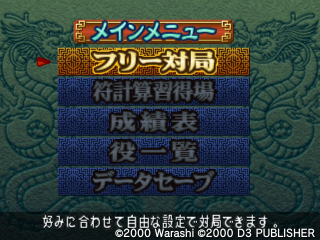
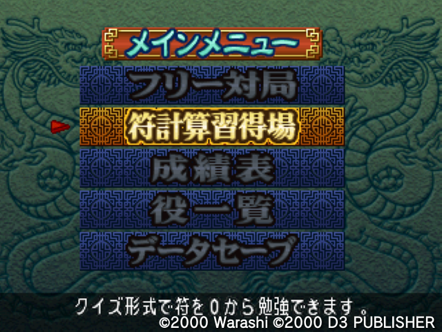
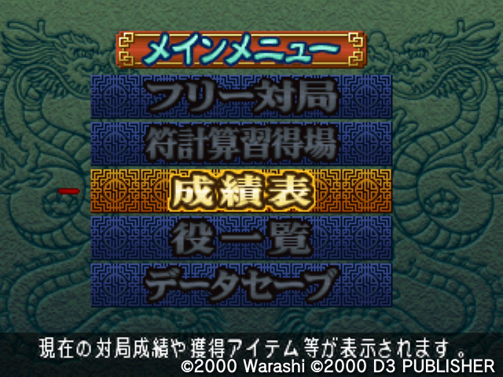

# A translation effort so that I know what I click on
#### Title screen

フリー[対局]("たいきょく")  
[好]("このみ")みに合わせて[自由]("じゆう")な[設定]("せってい")で対局できます。

[符]("ふ")[計算]("けいさん")[習得]("しゅうとく")場  
クイズ[形式]("けいしき")で符を0から勉強できます。

[成績]("せいせき")[表]("ひょう")  
[現在]("げんざい")の対局績や[獲得]("かくとく")アイテム[等]("など")が[表示]("ひょうじ")されます。
